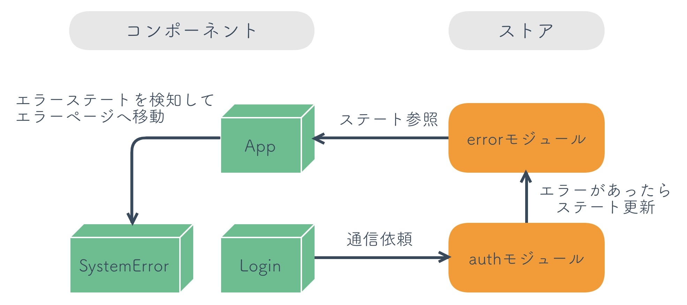

# Laravel + Vuejs

Laravel は標準でフロントエンドのビルド環境があり、これは Laravel Mix という。(webpack でビルドされている)

=> `webpack.mix.js`

Docker コンテナ上で BrowserSync を使いたいなら

=> 3000 番ポートの疎通が正常に出来るように Docker を設定する

[PHP]RouteServiceProvider はアプリケーションの起動時にルート定義を読み込むためのクラス

[PHP]ミドルウェアグループの定義は app/Http/Kernel.php

[PHP]api ミドルウェアグループでは本来、外部のアプリケーションから呼び出されるようなステートレスな Web API（Twitter API や Google Map API などをイメージしてください）が想定されている(app/Http/Kernel.php の\$middlewareGroups 変数)

[PHP] `php artisan make:test RegisterApiTest` で RegisterApiTest のテストクラスを作成することが出来る

[PHP] `./vendor/bin/phpunit --testdox` で単体テストを実行することができる

[PHP] Illuminate\Foundation\Http\Request と Illuminate\Http\Request は大違いだから本当に間違えないように注意。
じゃないと API のメソッドに渡ってくる値に違いが出て、response_status_code がおかしくなる。だいたい 500 になる。

[PHP] 単体テストはメソッド名の先頭に `test` を必ずつけること

[VueRouter] RouterLink は RouterView と一緒で VueRouter のコンポーネント
レンダリングは a タグのアンカーリンクだが、普通のアンカーリンクと違うのは通常の画面遷移はせずに VueRouter によるコンポーネントの切り替わりが発生するだけ

必ず RouterLink を使って画面遷移すること

[psql] migrate
root@d2f92141d898:/var/www# php artisan migrate
Migration table created successfully.
Migrating: 2014_10_12_000000_create_users_table
Migrated: 2014_10_12_000000_create_users_table
Migrating: 2014_10_12_100000_create_password_resets_table
Migrated: 2014_10_12_100000_create_password_resets_table

[psql] Postgresql にログインして、DB 選択

```sql
> docker-compose exec workspace psql -U default -h postgres
Password for user default:

        ^
default=# \c vuesplash;
default=# \q
```

[PHP] 作り途中だったから理解をするまでにかなり時間がかかったが、laravel_session にはログインしたユーザの情報が cookie として登録されている。これがあると、再度ユーザ登録しようとしてもエラーとなりリダイレクトするようになる、なのでログアウト時にはこの値を削除するような処理を加えなければならない(これ本当に数時間かかった)

[PHP/Vuejs] なぜかわからないが、ちゃんと実装していてもステータス 422 や 419 が帰ってくるときがある。419 は XSRF の設定がおかしいから Cookie を確認して、リロードしまくれば OK。422 は本当にわからない、curl ではレスポンスが返るが、画面からはエラーになったり、これもリロードしまくって治った.ソースコードは何も悪くなかった

[Ngix,PHP-fpm] nginx から fastcgi_pass で Laravel へリクエストをプロキシさせていたが、api 側へのリクエストをプロキシさせるまでにかなり時間を要した。直したのは、 `location / {}` の箇所を try_file でリクエストを飛ばすようにした

```nginx
  location / {
    # root /var/www/public;
    # index  index.html index.php;
    try_files $uri $uri/ /index.php$is_args$args;
  }
```

[PHP] `RedirectIfAuthenticated.php` のミドルウェアはログイン状態で非ログイン状態でのみアクセスできる機能にリクエストを送信した場合に `/home` へデフォルトでリダイレクトが返却される。
今回は SPA なので HTML を返したくないから `/api/user` に変える

[Vuejs] アプリ起動時になにか処理をしたいなら `new Vue()` の前に処理を記載する。非同期が必要なら async 関数を作成して呼び出せば良い(app.js)

[Vuejs]\(非)ログイン状態の時に特定のフロントの URL にアクセス制御したい場合はナビゲーションガードを行うと良い。(`router.jsのbeforeEnter`)

[Vuejs] あるストアモジュールから別のモジュールのミューテーションを commit する場合は第三引数に { root: true } を追加します。

```js
context.commit("error/setCode", response.status, { root: true });
```

[Vuejs] 全体のエラー(errorCode)を App.vue で管理・監視して、システムエラー画面へ遷移するようにした。
理解が難しい箇所なので、下記の画像を見ながら確認。

```
Login.vue
=> auth.js
=> (throw new Error())
=> error.js
=> App.vue(errorCode を監視)
=> SystemError.vue(エラー画面)
```



[Vuex] vuex の mapState を使うと更に書きやすくなる

コンポーネントの算出プロパティとストアのステートをマッピングする関数で、
自分の書きやすいように書けば良い(`Login.vue`)

```js
import { mapState } from "vuex";

export default {
  computed: {
    // apiStatus() {
    //   return this.$store.state.auth.apiStatus;
    // },
    // loginErrors() {
    //   return this.$store.state.auth.loginErrorMessages;
    // }
    ...mapState({
      apiStatus: state => state.auth.apiStatus,
      loginErrors: state => state.auth.loginErrorMessages
    })
}
```
